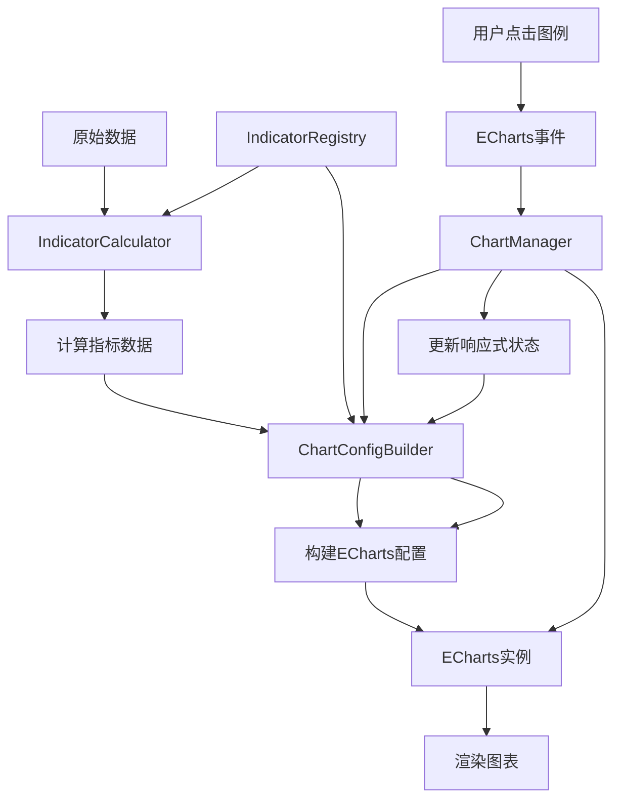
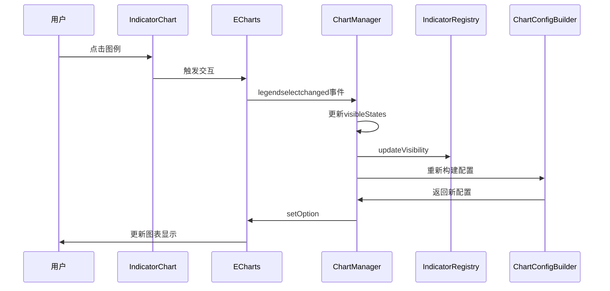

# ETF量化分析系统 - 图表组件架构设计文档

## 文档版本
- **版本**: 1.0
- **创建日期**: 2026-03-21
- **状态**: 设计阶段

---

## 1. 当前问题分析

### 1.1 现有问题

基于对 [`Screening.vue`](web/src/views/Screening.vue:1) 的分析，当前图表实现存在以下问题：

#### 问题1：不能隐藏某条线
- **位置**: [`Screening.vue:474-479`](web/src/views/Screening.vue:474) 和 [`Screening.vue:592-596`](web/src/views/Screening.vue:592)
- **原因**: `legend.selected` 是静态配置，没有响应式绑定
- **影响**: 用户点击图例时无法真正隐藏/显示线条
- **缺失**: 没有 `legendselectchanged` 事件监听

#### 问题2：不能在选点显示数值
- **位置**: [`Screening.vue:451-469`](web/src/views/Screening.vue:451) 和 [`Screening.vue:569-587`](web/src/views/Screening.vue:569)
- **原因**: tooltip 配置存在但可能有显示问题
- **影响**: 数据点提示可能不显示或显示不正确

#### 问题3：扩展性差
- **位置**: [`Screening.vue:436-671`](web/src/views/Screening.vue:436)
- **原因**: 硬编码的图表配置
- **影响**: 
  - 添加新指标（RSI、KDJ）需要大量修改
  - 技术指标计算函数分散在组件中
  - 图表配置耦合在业务逻辑中

### 1.2 当前架构缺陷

```
当前架构（Screening.vue）:
┌─────────────────────────────────────┐
│  Screening.vue (单文件组件)         │
│  ├─ 查询逻辑                        │
│  ├─ 技术指标计算 (SMA, EMA, MACD,  │
│  │   Bollinger, RSI)               │
│  ├─ 图表初始化 (initCharts)        │
│  ├─ 图表更新 (updateCharts)        │
│  └─ 硬编码图表配置                  │
└─────────────────────────────────────┘
         ↓
    ECharts实例
```

**缺陷**:
- 单一职责原则违反：组件承担太多职责
- 开闭原则违反：添加新指标需要修改现有代码
- 依赖倒置原则违反：高层模块直接依赖ECharts细节
- 代码复用性差：技术指标和图表配置无法复用

---

## 2. 整体架构设计

### 2.1 架构目标

1. **可扩展性**: 添加新指标只需配置，无需修改核心代码
2. **响应式**: 线条显示状态与用户交互实时同步
3. **可维护性**: 模块化设计，职责清晰
4. **可复用性**: 图表组件可在其他页面复用
5. **类型安全**: 使用TypeScript类型定义

### 2.2 分层架构

```
┌─────────────────────────────────────────────────────────────┐
│                    表现层 (Presentation)                      │
│  ┌───────────────────────────────────────────────────────┐  │
│  │  Screening.vue (业务组件)                              │  │
│  │  - 查询参数管理                                        │  │
│  │  - 数据获取                                            │  │
│  │  - 表格显示                                            │  │
│  └───────────────────────────────────────────────────────┘  │
│                            ↓                                │
│  ┌───────────────────────────────────────────────────────┐  │
│  │  IndicatorChart.vue (图表组件)                         │  │
│  │  - 图表容器管理                                        │  │
│  │  - 数据传递                                            │  │
│  │  - 事件处理                                            │  │
│  └───────────────────────────────────────────────────────┘  │
└─────────────────────────────────────────────────────────────┘
                            ↓
┌─────────────────────────────────────────────────────────────┐
│                    业务逻辑层 (Business Logic)               │
│  ┌───────────────────────────────────────────────────────┐  │
│  │  ChartManager.js (图表管理器)                         │  │
│  │  - 图表实例管理                                        │  │
│  │  - 图表生命周期管理                                    │  │
│  │  - 事件协调                                            │  │
│  └───────────────────────────────────────────────────────┘  │
│  ┌───────────────────────────────────────────────────────┐  │
│  │  IndicatorRegistry.js (指标注册表)                    │  │
│  │  - 指标注册                                            │  │
│  │  - 指标查询                                            │  │
│  │  - 指标配置管理                                        │  │
│  └───────────────────────────────────────────────────────┘  │
└─────────────────────────────────────────────────────────────┘
                            ↓
┌─────────────────────────────────────────────────────────────┐
│                    数据处理层 (Data Processing)              │
│  ┌───────────────────────────────────────────────────────┐  │
│  │  IndicatorCalculator.js (指标计算器)                  │  │
│  │  - SMA 计算                                            │  │
│  │  - EMA 计算                                            │  │
│  │  - MACD 计算                                           │  │
│  │  - Bollinger Bands 计算                               │  │
│  │  - RSI 计算                                            │  │
│  │  - KDJ 计算                                            │  │
│  └───────────────────────────────────────────────────────┘  │
│  ┌───────────────────────────────────────────────────────┐  │
│  │  ChartConfigBuilder.js (图表配置构建器)               │  │
│  │  - 生成 ECharts 配置                                  │  │
│  │  - 处理响应式 legend                                   │  │
│  │  - 处理 tooltip                                        │  │
│  └───────────────────────────────────────────────────────┘  │
└─────────────────────────────────────────────────────────────┘
                            ↓
┌─────────────────────────────────────────────────────────────┐
│                    基础设施层 (Infrastructure)                │
│  ┌───────────────────────────────────────────────────────┐  │
│  │  IndicatorConfig.js (指标配置)                        │  │
│  │  - 指标元数据                                          │  │
│  │  - 默认配置                                            │  │
│  └───────────────────────────────────────────────────────┘  │
│  ┌───────────────────────────────────────────────────────┐  │
│  │  ChartTheme.js (图表主题)                             │  │
│  │  - 颜色方案                                            │  │
│  │  - 样式配置                                            │  │
│  └───────────────────────────────────────────────────────┘  │
└─────────────────────────────────────────────────────────────┘
```

### 2.3 数据流设计

```
用户交互
   ↓
Screening.vue (业务组件)
   ↓
IndicatorChart.vue (图表组件)
   ↓
ChartManager.js (图表管理器)
   ↓
┌─────────────────────────────────────┐
│  IndicatorRegistry.js               │
│  (获取指标配置)                      │
└─────────────────────────────────────┘
   ↓
┌─────────────────────────────────────┐
│  IndicatorCalculator.js            │
│  (计算指标数据)                      │
└─────────────────────────────────────┘
   ↓
┌─────────────────────────────────────┐
│  ChartConfigBuilder.js              │
│  (构建图表配置)                      │
└─────────────────────────────────────┘
   ↓
ECharts 实例渲染
   ↓
用户查看图表
```

### 2.4 事件流设计

```
用户点击图例
   ↓
ECharts 触发 legendselectchanged 事件
   ↓
ChartManager 监听事件
   ↓
更新响应式 legend 状态
   ↓
通知 ChartConfigBuilder
   ↓
重新生成图表配置
   ↓
ECharts 更新图表
```

---

## 3. 文件结构设计

### 3.1 新增文件结构

```
web/src/
├── components/
│   └── charts/                          # 图表组件目录
│       ├── IndicatorChart.vue           # 主图表组件
│       ├── ChartManager.js              # 图表管理器
│       ├── IndicatorRegistry.js         # 指标注册表
│       ├── IndicatorCalculator.js       # 指标计算器
│       ├── ChartConfigBuilder.js        # 图表配置构建器
│       ├── IndicatorConfig.js           # 指标配置
│       ├── ChartTheme.js                # 图表主题
│       └── types/
│           ├── indicator.types.js       # 指标类型定义
│           └── chart.types.js           # 图表类型定义
├── utils/
│   └── indicators/                      # 指标工具函数
│       ├── sma.js                       # SMA 计算
│       ├── ema.js                       # EMA 计算
│       ├── macd.js                      # MACD 计算
│       ├── bollinger.js                 # 布林带计算
│       ├── rsi.js                       # RSI 计算
│       └── kdj.js                       # KDJ 计算
└── views/
    └── Screening.vue                    # 重构后的业务组件
```

### 3.2 文件职责说明

| 文件 | 职责 |
|------|------|
| [`IndicatorChart.vue`](web/src/components/charts/IndicatorChart.vue:1) | 图表组件容器，负责图表实例的创建、更新、销毁，处理用户交互事件 |
| [`ChartManager.js`](web/src/components/charts/ChartManager.js:1) | 管理多个图表实例，协调图表间的交互，处理全局事件 |
| [`IndicatorRegistry.js`](web/src/components/charts/IndicatorRegistry.js:1) | 指标注册中心，管理所有指标的配置和元数据 |
| [`IndicatorCalculator.js`](web/src/components/charts/IndicatorCalculator.js:1) | 统一的指标计算接口，调用底层计算函数 |
| [`ChartConfigBuilder.js`](web/src/components/charts/ChartConfigBuilder.js:1) | 构建 ECharts 配置，处理响应式 legend 和 tooltip |
| [`IndicatorConfig.js`](web/src/components/charts/IndicatorConfig.js:1) | 定义所有指标的配置（名称、类型、颜色、图表归属等） |
| [`ChartTheme.js`](web/src/components/charts/ChartTheme.js:1) | 定义图表主题（颜色方案、样式配置） |
| [`indicator.types.js`](web/src/components/charts/types/indicator.types.js:1) | 指标相关的 TypeScript 类型定义 |
| [`chart.types.js`](web/src/components/charts/types/chart.types.js:1) | 图表相关的 TypeScript 类型定义 |
| [`sma.js`](web/src/utils/indicators/sma.js:1) | SMA 算法实现 |
| [`ema.js`](web/src/utils/indicators/ema.js:1) | EMA 算法实现 |
| [`macd.js`](web/src/utils/indicators/macd.js:1) | MACD 算法实现 |
| [`bollinger.js`](web/src/utils/indicators/bollinger.js:1) | 布林带算法实现 |
| [`rsi.js`](web/src/utils/indicators/rsi.js:1) | RSI 算法实现 |
| [`kdj.js`](web/src/utils/indicators/kdj.js:1) | KDJ 算法实现 |
| [`Screening.vue`](web/src/views/Screening.vue:1) | 重构后的业务组件，专注于业务逻辑 |

---

## 4. 核心模块设计

### 4.1 指标配置系统

#### 4.1.1 指标配置接口

```javascript
// web/src/components/charts/types/indicator.types.js

/**
 * 指标类型枚举
 */
export const IndicatorType = {
  SMA: 'sma',
  EMA: 'ema',
  MACD: 'macd',
  BOLLINGER: 'bollinger',
  RSI: 'rsi',
  KDJ: 'kdj'
}

/**
 * 图表类型枚举
 */
export const ChartType = {
  MAIN: 'main',        // 主图表（价格）
  MACD: 'macd',        // MACD图表
  RSI: 'rsi',          // RSI图表
  KDJ: 'kdj'           // KDJ图表
}

/**
 * 指标配置接口
 */
export class IndicatorConfig {
  /**
   * @param {string} id - 指标唯一标识
   * @param {string} name - 指标显示名称
   * @param {IndicatorType} type - 指标类型
   * @param {ChartType} chartType - 所属图表类型
   * @param {string} seriesType - ECharts 系列类型 (line, bar)
   * @param {Object} seriesConfig - ECharts 系列配置
   * @param {Object} defaultParams - 默认计算参数
   * @param {boolean} visible - 默认是否可见
   * @param {Function} tooltipFormatter - 自定义 tooltip 格式化函数
   */
  constructor({
    id,
    name,
    type,
    chartType,
    seriesType,
    seriesConfig = {},
    defaultParams = {},
    visible = true,
    tooltipFormatter = null
  }) {
    this.id = id
    this.name = name
    this.type = type
    this.chartType = chartType
    this.seriesType = seriesType
    this.seriesConfig = seriesConfig
    this.defaultParams = defaultParams
    this.visible = visible
    this.tooltipFormatter = tooltipFormatter
  }
}

/**
 * 复合指标配置（如MACD包含快线、信号线、柱状图）
 */
export class CompositeIndicatorConfig {
  /**
   * @param {string} id - 指标唯一标识
   * @param {string} name - 指标显示名称
   * @param {IndicatorType} type - 指标类型
   * @param {ChartType} chartType - 所属图表类型
   * @param {Array<IndicatorConfig>} subIndicators - 子指标配置
   * @param {Object} defaultParams - 默认计算参数
   */
  constructor({
    id,
    name,
    type,
    chartType,
    subIndicators,
    defaultParams = {}
  }) {
    this.id = id
    this.name = name
    this.type = type
    this.chartType = chartType
    this.subIndicators = subIndicators
    this.defaultParams = defaultParams
  }
}
```

#### 4.1.2 指标配置示例

```javascript
// web/src/components/charts/IndicatorConfig.js

import { IndicatorConfig, CompositeIndicatorConfig, IndicatorType, ChartType } from './types/indicator.types.js'

/**
 * 布林带指标配置
 */
export const bollingerIndicator = new IndicatorConfig({
  id: 'bollinger',
  name: '布林带',
  type: IndicatorType.BOLLINGER,
  chartType: ChartType.MAIN,
  seriesType: 'line',
  seriesConfig: {
    smooth: true,
    lineStyle: { width: 1, type: 'dashed' }
  },
  defaultParams: { period: 20, stdDev: 2 },
  visible: true
})

/**
 * 布林带上轨配置
 */
export const bollingerUpperConfig = new IndicatorConfig({
  id: 'bollinger_upper',
  name: '布林带上轨',
  type: IndicatorType.BOLLINGER,
  chartType: ChartType.MAIN,
  seriesType: 'line',
  seriesConfig: {
    smooth: true,
    lineStyle: { width: 1, type: 'dashed' },
    itemStyle: { color: '#ee6666' }
  },
  defaultParams: { period: 20, stdDev: 2 },
  visible: true
})

/**
 * 布林带中轨配置
 */
export const bollingerMiddleConfig = new IndicatorConfig({
  id: 'bollinger_middle',
  name: '布林带中轨',
  type: IndicatorType.BOLLINGER,
  chartType: ChartType.MAIN,
  seriesType: 'line',
  seriesConfig: {
    smooth: true,
    lineStyle: { width: 1 },
    itemStyle: { color: '#91cc75' }
  },
  defaultParams: { period: 20 },
  visible: true
})

/**
 * 布林带下轨配置
 */
export const bollingerLowerConfig = new IndicatorConfig({
  id: 'bollinger_lower',
  name: '布林带下轨',
  type: IndicatorType.BOLLINGER,
  chartType: ChartType.MAIN,
  seriesType: 'line',
  seriesConfig: {
    smooth: true,
    lineStyle: { width: 1, type: 'dashed' },
    itemStyle: { color: '#ee6666' }
  },
  defaultParams: { period: 20, stdDev: 2 },
  visible: true
})

/**
 * MACD指标配置（复合指标）
 */
export const macdIndicator = new CompositeIndicatorConfig({
  id: 'macd',
  name: 'MACD',
  type: IndicatorType.MACD,
  chartType: ChartType.MACD,
  subIndicators: [
    new IndicatorConfig({
      id: 'macd_fast',
      name: 'MACD（快线）',
      type: IndicatorType.MACD,
      chartType: ChartType.MACD,
      seriesType: 'line',
      seriesConfig: {
        smooth: true,
        lineStyle: { width: 2 },
        itemStyle: { color: '#5470c6' }
      },
      defaultParams: { fastPeriod: 12, slowPeriod: 26 },
      visible: true
    }),
    new IndicatorConfig({
      id: 'macd_signal',
      name: '慢线（信号线）',
      type: IndicatorType.MACD,
      chartType: ChartType.MACD,
      seriesType: 'line',
      seriesConfig: {
        smooth: true,
        lineStyle: { width: 2 },
        itemStyle: { color: '#fac858' }
      },
      defaultParams: { signalPeriod: 9 },
      visible: true
    }),
    new IndicatorConfig({
      id: 'macd_hist',
      name: '柱状图',
      type: IndicatorType.MACD,
      chartType: ChartType.MACD,
      seriesType: 'bar',
      seriesConfig: {
        itemStyle: {
          color: (params) => {
            return params.value >= 0 ? '#91cc75' : '#ee6666'
          }
        }
      },
      defaultParams: {},
      visible: true
    })
  ],
  defaultParams: { fastPeriod: 12, slowPeriod: 26, signalPeriod: 9 }
})

/**
 * RSI指标配置
 */
export const rsiIndicator = new IndicatorConfig({
  id: 'rsi',
  name: 'RSI',
  type: IndicatorType.RSI,
  chartType: ChartType.RSI,
  seriesType: 'line',
  seriesConfig: {
    smooth: true,
    lineStyle: { width: 2 },
    itemStyle: { color: '#73c0de' }
  },
  defaultParams: { period: 14 },
  visible: true
})

/**
 * KDJ指标配置（复合指标）
 */
export const kdjIndicator = new CompositeIndicatorConfig({
  id: 'kdj',
  name: 'KDJ',
  type: IndicatorType.KDJ,
  chartType: ChartType.KDJ,
  subIndicators: [
    new IndicatorConfig({
      id: 'kdj_k',
      name: 'K线',
      type: IndicatorType.KDJ,
      chartType: ChartType.KDJ,
      seriesType: 'line',
      seriesConfig: {
        smooth: true,
        lineStyle: { width: 2 },
        itemStyle: { color: '#5470c6' }
      },
      defaultParams: { period: 9, kPeriod: 3, dPeriod: 3 },
      visible: true
    }),
    new IndicatorConfig({
      id: 'kdj_d',
      name: 'D线',
      type: IndicatorType.KDJ,
      chartType: ChartType.KDJ,
      seriesType: 'line',
      seriesConfig: {
        smooth: true,
        lineStyle: { width: 2 },
        itemStyle: { color: '#fac858' }
      },
      defaultParams: { period: 9, kPeriod: 3, dPeriod: 3 },
      visible: true
    }),
    new IndicatorConfig({
      id: 'kdj_j',
      name: 'J线',
      type: IndicatorType.KDJ,
      chartType: ChartType.KDJ,
      seriesType: 'line',
      seriesConfig: {
        smooth: true,
        lineStyle: { width: 2 },
        itemStyle: { color: '#ee6666' }
      },
      defaultParams: { period: 9, kPeriod: 3, dPeriod: 3 },
      visible: true
    })
  ],
  defaultParams: { period: 9, kPeriod: 3, dPeriod: 3 }
})

/**
 * 默认指标配置列表
 */
export const defaultIndicators = [
  bollingerUpperConfig,
  bollingerMiddleConfig,
  bollingerLowerConfig,
  macdIndicator,
  rsiIndicator,
  kdjIndicator
]
```

### 4.2 指标注册表

#### 4.2.1 IndicatorRegistry 接口设计

```javascript
// web/src/components/charts/IndicatorRegistry.js

import { IndicatorConfig, CompositeIndicatorConfig } from './types/indicator.types.js'
import { defaultIndicators } from './IndicatorConfig.js'

/**
 * 指标注册表类
 * 负责管理所有指标的注册、查询和配置
 */
export class IndicatorRegistry {
  constructor() {
    this.indicators = new Map() // id -> IndicatorConfig
    this.chartIndicators = new Map() // chartType -> Array<IndicatorConfig>
    this.visibleStates = new Map() // id -> boolean
  }

  /**
   * 注册指标
   * @param {IndicatorConfig|CompositeIndicatorConfig} indicator - 指标配置
   */
  register(indicator) {
    if (indicator instanceof CompositeIndicatorConfig) {
      // 注册复合指标
      this.indicators.set(indicator.id, indicator)
      
      // 注册子指标
      indicator.subIndicators.forEach(sub => {
        this.indicators.set(sub.id, sub)
        this._addToChartMap(sub)
        this.visibleStates.set(sub.id, sub.visible)
      })
    } else {
      // 注册简单指标
      this.indicators.set(indicator.id, indicator)
      this._addToChartMap(indicator)
      this.visibleStates.set(indicator.id, indicator.visible)
    }
  }

  /**
   * 批量注册指标
   * @param {Array<IndicatorConfig|CompositeIndicatorConfig>} indicators - 指标配置数组
   */
  registerBatch(indicators) {
    indicators.forEach(indicator => this.register(indicator))
  }

  /**
   * 获取指标配置
   * @param {string} id - 指标ID
   * @returns {IndicatorConfig|CompositeIndicatorConfig|null}
   */
  get(id) {
    return this.indicators.get(id) || null
  }

  /**
   * 获取指定图表的所有指标
   * @param {ChartType} chartType - 图表类型
   * @returns {Array<IndicatorConfig>}
   */
  getByChartType(chartType) {
    return this.chartIndicators.get(chartType) || []
  }

  /**
   * 获取所有指标
   * @returns {Array<IndicatorConfig|CompositeIndicatorConfig>}
   */
  getAll() {
    return Array.from(this.indicators.values())
  }

  /**
   * 更新指标可见性
   * @param {string} id - 指标ID
   * @param {boolean} visible - 是否可见
   */
  updateVisibility(id, visible) {
    this.visibleStates.set(id, visible)
  }

  /**
   * 获取指标可见性
   * @param {string} id - 指标ID
   * @returns {boolean}
   */
  getVisibility(id) {
    return this.visibleStates.get(id) ?? true
  }

  /**
   * 获取指定图表的 legend 配置
   * @param {ChartType} chartType - 图表类型
   * @returns {Object}
   */
  getLegendConfig(chartType) {
    const indicators = this.getByChartType(chartType)
    const selected = {}
    const data = []

    indicators.forEach(indicator => {
      data.push(indicator.name)
      selected[indicator.name] = this.getVisibility(indicator.id)
    })

    return {
      show: true,
      data,
      selected
    }
  }

  /**
   * 私有方法：添加到图表映射
   * @private
   */
  _addToChartMap(indicator) {
    const chartType = indicator.chartType
    if (!this.chartIndicators.has(chartType)) {
      this.chartIndicators.set(chartType, [])
    }
    this.chartIndicators.get(chartType).push(indicator)
  }
}

/**
 * 创建全局指标注册表实例
 */
export const indicatorRegistry = new IndicatorRegistry()

/**
 * 注册默认指标
 */
export function registerDefaultIndicators() {
  indicatorRegistry.registerBatch(defaultIndicators)
}
```

### 4.3 响应式线条控制机制

#### 4.3.1 响应式状态管理

```javascript
// web/src/components/charts/ChartManager.js

import { ref, reactive, onUnmounted } from 'vue'
import { indicatorRegistry } from './IndicatorRegistry.js'
import { ChartType } from './types/indicator.types.js'

/**
 * 图表管理器类
 * 负责管理多个图表实例，处理响应式线条控制
 */
export class ChartManager {
  constructor() {
    // 图表实例映射
    this.charts = new Map() // chartType -> ECharts instance
    
    // 响应式线条可见性状态
    this.visibleStates = reactive({})
    
    // 图表引用映射
    this.chartRefs = new Map() // chartType -> ref
    
    // 事件监听器映射
    this.eventListeners = new Map() // chartType -> Array<Function>
  }

  /**
   * 初始化图表
   * @param {ChartType} chartType - 图表类型
   * @param {Object} chartRef - 图表DOM引用
   * @param {Function} echartsInit - ECharts初始化函数
   */
  initChart(chartType, chartRef, echartsInit) {
    // 保存图表引用
    this.chartRefs.set(chartType, chartRef)
    
    // 创建图表实例
    const chart = echartsInit(chartRef.value)
    this.charts.set(chartType, chart)
    
    // 初始化可见性状态
    const indicators = indicatorRegistry.getByChartType(chartType)
    indicators.forEach(indicator => {
      this.visibleStates[indicator.id] = indicator.visible
    })
    
    // 监听 legendselectchanged 事件
    this._setupLegendListener(chartType)
  }

  /**
   * 设置 legend 事件监听
   * @private
   */
  _setupLegendListener(chartType) {
    const chart = this.charts.get(chartType)
    if (!chart) return
    
    const handler = (params) => {
      // 更新响应式状态
      const indicators = indicatorRegistry.getByChartType(chartType)
      indicators.forEach(indicator => {
        if (indicator.name === params.name) {
          this.visibleStates[indicator.id] = params.selected
          // 同步更新注册表中的状态
          indicatorRegistry.updateVisibility(indicator.id, params.selected)
        }
      })
    }
    
    chart.on('legendselectchanged', handler)
    
    // 保存监听器以便清理
    if (!this.eventListeners.has(chartType)) {
      this.eventListeners.set(chartType, [])
    }
    this.eventListeners.get(chartType).push(handler)
  }

  /**
   * 获取图表实例
   * @param {ChartType} chartType - 图表类型
   * @returns {ECharts|null}
   */
  getChart(chartType) {
    return this.charts.get(chartType) || null
  }

  /**
   * 获取线条可见性状态
   * @param {string} indicatorId - 指标ID
   * @returns {boolean}
   */
  isVisible(indicatorId) {
    return this.visibleStates[indicatorId] ?? true
  }

  /**
   * 批量获取线条可见性状态
   * @param {ChartType} chartType - 图表类型
   * @returns {Object} - { indicatorName: boolean }
   */
  getVisibleStates(chartType) {
    const indicators = indicatorRegistry.getByChartType(chartType)
    const states = {}
    indicators.forEach(indicator => {
      states[indicator.name] = this.visibleStates[indicator.id] ?? true
    })
    return states
  }

  /**
   * 调整图表大小
   * @param {ChartType} chartType - 图表类型
   */
  resize(chartType) {
    const chart = this.charts.get(chartType)
    if (chart) {
      chart.resize()
    }
  }

  /**
   * 调整所有图表大小
   */
  resizeAll() {
    this.charts.forEach(chart => chart.resize())
  }

  /**
   * 销毁图表
   * @param {ChartType} chartType - 图表类型
   */
  dispose(chartType) {
    const chart = this.charts.get(chartType)
    if (chart) {
      chart.dispose()
      this.charts.delete(chartType)
      this.chartRefs.delete(chartType)
      
      // 移除事件监听器
      const listeners = this.eventListeners.get(chartType) || []
      listeners.forEach(handler => chart.off('legendselectchanged', handler))
      this.eventListeners.delete(chartType)
    }
  }

  /**
   * 销毁所有图表
   */
  disposeAll() {
    this.charts.forEach((chart, chartType) => {
      this.dispose(chartType)
    })
  }
}
```

### 4.4 动态图表管理系统

#### 4.4.1 图表配置构建器

```javascript
// web/src/components/charts/ChartConfigBuilder.js

import { ChartType } from './types/indicator.types.js'
import { indicatorRegistry } from './IndicatorRegistry.js'

/**
 * 图表配置构建器类
 * 负责构建 ECharts 配置
 */
export class ChartConfigBuilder {
  constructor(chartManager) {
    this.chartManager = chartManager
  }

  /**
   * 构建图表配置
   * @param {ChartType} chartType - 图表类型
   * @param {Object} data - 图表数据
   * @param {Object} options - 可选配置
   * @returns {Object} ECharts 配置对象
   */
  build(chartType, data, options = {}) {
    const baseConfig = this._getBaseConfig(chartType, options)
    const seriesConfig = this._buildSeries(chartType, data)
    const legendConfig = this._buildLegend(chartType)
    const xAxisConfig = this._buildXAxis(data.dates)
    const yAxisConfig = this._buildYAxis(chartType)
    const tooltipConfig = this._buildTooltip(chartType)
    const dataZoomConfig = this._buildDataZoom()

    return {
      ...baseConfig,
      legend: legendConfig,
      xAxis: xAxisConfig,
      yAxis: yAxisConfig,
      tooltip: tooltipConfig,
      dataZoom: dataZoomConfig,
      series: seriesConfig
    }
  }

  /**
   * 构建系列配置
   * @private
   */
  _buildSeries(chartType, data) {
    const indicators = indicatorRegistry.getByChartType(chartType)
    const series = []

    // 添加价格系列（仅主图表）
    if (chartType === ChartType.MAIN) {
      series.push({
        name: '收盘价',
        type: 'line',
        data: data.closes,
        smooth: true,
        itemStyle: { color: '#5470c6' },
        lineStyle: { width: 2 }
      })
    }

    // 添加指标系列
    indicators.forEach(indicator => {
      const indicatorData = data[indicator.id]
      if (indicatorData) {
        series.push({
          name: indicator.name,
          type: indicator.seriesType,
          data: indicatorData,
          ...indicator.seriesConfig
        })
      }
    })

    return series
  }

  /**
   * 构建 legend 配置（响应式）
   * @private
   */
  _buildLegend(chartType) {
    const visibleStates = this.chartManager.getVisibleStates(chartType)
    const indicators = indicatorRegistry.getByChartType(chartType)
    
    const data = ['收盘价', ...indicators.map(i => i.name)]
    
    return {
      show: true,
      data,
      selected: visibleStates
    }
  }

  /**
   * 构建 tooltip 配置
   * @private
   */
  _buildTooltip(chartType) {
    return {
      show: true,
      trigger: 'axis',
      confine: true,
      axisPointer: {
        type: 'cross',
        label: {
          backgroundColor: '#6a7985'
        }
      },
      formatter: (params) => this._tooltipFormatter(params)
    }
  }

  /**
   * Tooltip 格式化函数
   * @private
   */
  _tooltipFormatter(params) {
    if (!params || params.length === 0) return ''
    
    let result = params[0].axisValue + '<br/>'
    
    params.forEach(param => {
      if (param.value !== null && param.value !== undefined) {
        result += `${param.marker} ${param.seriesName}: ${Number(param.value).toFixed(3)}<br/>`
      }
    })
    
    return result
  }

  /**
   * 构建 X 轴配置
   * @private
   */
  _buildXAxis(dates) {
    return {
      type: 'category',
      data: dates,
      scale: true
    }
  }

  /**
   * 构建 Y 轴配置
   * @private
   */
  _buildYAxis(chartType) {
    const config = {
      type: 'value',
      scale: true,
      axisLabel: {
        formatter: '{value}'
      }
    }

    // RSI 和 KDJ 有固定的范围
    if (chartType === ChartType.RSI || chartType === ChartType.KDJ) {
      config.min = 0
      config.max = 100
    }

    return config
  }

  /**
   * 构建 dataZoom 配置
   * @private
   */
  _buildDataZoom() {
    return [
      {
        type: 'inside',
        start: 50,
        end: 100
      },
      {
        show: true,
        type: 'slider',
        top: '90%',
        start: 50,
        end: 100
      }
    ]
  }

  /**
   * 获取基础配置
   * @private
   */
  _getBaseConfig(chartType, options) {
    return {
      grid: {
        left: '3%',
        right: '3%',
        top: '20%',
        bottom: '20%',
        containLabel: true
      },
      animation: options.animation !== false
    }
  }
}
```

### 4.5 指标计算器

#### 4.5.1 IndicatorCalculator 接口设计

```javascript
// web/src/components/charts/IndicatorCalculator.js

import { calculateSMA } from '@/utils/indicators/sma.js'
import { calculateEMA } from '@/utils/indicators/ema.js'
import { calculateMACD } from '@/utils/indicators/macd.js'
import { calculateBollingerBands } from '@/utils/indicators/bollinger.js'
import { calculateRSI } from '@/utils/indicators/rsi.js'
import { calculateKDJ } from '@/utils/indicators/kdj.js'
import { indicatorRegistry } from './IndicatorRegistry.js'
import { ChartType } from './types/indicator.types.js'

/**
 * 指标计算器类
 * 负责计算所有技术指标
 */
export class IndicatorCalculator {
  /**
   * 计算所有指标
   * @param {Array} data - 原始数据数组
   * @param {Array<string>} indicatorIds - 需要计算的指标ID列表
   * @returns {Object} - 指标数据对象
   */
  calculateAll(data, indicatorIds = null) {
    const closes = data.map(d => d.close)
    const highs = data.map(d => d.high)
    const lows = data.map(d => d.low)
    
    const result = {
      dates: data.map(d => d.date),
      closes,
      highs,
      lows
    }

    // 如果没有指定指标，计算所有注册的指标
    if (!indicatorIds) {
      indicatorIds = indicatorRegistry.getAll().map(i => i.id)
    }

    // 计算每个指标
    indicatorIds.forEach(id => {
      const indicator = indicatorRegistry.get(id)
      if (indicator) {
        const indicatorData = this._calculateIndicator(
          indicator,
          closes,
          highs,
          lows
        )
        result[id] = indicatorData
      }
    })

    return result
  }

  /**
   * 计算单个指标
   * @private
   */
  _calculateIndicator(indicator, closes, highs, lows) {
    const params = indicator.defaultParams

    switch (indicator.type) {
      case 'sma':
        return calculateSMA(closes, params.period)
      
      case 'ema':
        return calculateEMA(closes, params.period)
      
      case 'macd':
        const macdResult = calculateMACD(
          closes,
          params.fastPeriod,
          params.slowPeriod,
          params.signalPeriod
        )
        // 返回复合指标数据
        return {
          macd_fast: macdResult.macdLine,
          macd_signal: macdResult.signalLine,
          macd_hist: macdResult.histogram
        }
      
      case 'bollinger':
        const bbResult = calculateBollingerBands(
          closes,
          params.period,
          params.stdDev
        )
        // 返回复合指标数据
        return {
          bollinger_upper: bbResult.upper,
          bollinger_middle: bbResult.middle,
          bollinger_lower: bbResult.lower
        }
      
      case 'rsi':
        return calculateRSI(closes, params.period)
      
      case 'kdj':
        const kdjResult = calculateKDJ(
          highs,
          lows,
          closes,
          params.period,
          params.kPeriod,
          params.dPeriod
        )
        // 返回复合指标数据
        return {
          kdj_k: kdjResult.k,
          kdj_d: kdjResult.d,
          kdj_j: kdjResult.j
        }
      
      default:
        return null
    }
  }

  /**
   * 计算指定图表的指标
   * @param {Array} data - 原始数据数组
   * @param {ChartType} chartType - 图表类型
   * @returns {Object} - 指标数据对象
   */
  calculateForChart(data, chartType) {
    const indicators = indicatorRegistry.getByChartType(chartType)
    const indicatorIds = indicators.map(i => i.id)
    return this.calculateAll(data, indicatorIds)
  }
}
```

### 4.6 图表组件

#### 4.6.1 IndicatorChart 组件接口

```javascript
// web/src/components/charts/IndicatorChart.vue

<template>
  <div class="indicator-chart">
    <!-- 主图表 -->
    <div 
      v-if="chartTypes.includes('main')"
      ref="mainChartRef"
      class="chart main-chart"
    ></div>
    
    <!-- MACD图表 -->
    <div 
      v-if="chartTypes.includes('macd')"
      ref="macdChartRef"
      class="chart macd-chart"
    ></div>
    
    <!-- RSI图表 -->
    <div 
      v-if="chartTypes.includes('rsi')"
      ref="rsiChartRef"
      class="chart rsi-chart"
    ></div>
    
    <!-- KDJ图表 -->
    <div 
      v-if="chartTypes.includes('kdj')"
      ref="kdjChartRef"
      class="chart kdj-chart"
    ></div>
  </div>
</template>

<script setup>
import { ref, onMounted, onUnmounted, watch, nextTick } from 'vue'
import * as echarts from 'echarts'
import {
  LegendComponent,
  TooltipComponent,
  GridComponent,
  DataZoomComponent
} from 'echarts/components'
import { LineChart, BarChart } from 'echarts/charts'
import { ChartManager } from './ChartManager.js'
import { ChartConfigBuilder } from './ChartConfigBuilder.js'
import { IndicatorCalculator } from './IndicatorCalculator.js'
import { registerDefaultIndicators } from './IndicatorConfig.js'
import { ChartType } from './types/indicator.types.js'

// 注册 ECharts 组件
echarts.use([
  LegendComponent,
  TooltipComponent,
  GridComponent,
  DataZoomComponent,
  LineChart,
  BarChart
])

// Props
const props = defineProps({
  /**
   * 图表数据
   * @type {Array}
   */
  data: {
    type: Array,
    required: true
  },
  
  /**
   * 需要显示的图表类型
   * @type {Array<ChartType>}
   * @default ['main', 'macd']
   */
  chartTypes: {
    type: Array,
    default: () => ['main', 'macd'],
    validator: (value) => {
      const validTypes = ['main', 'macd', 'rsi', 'kdj']
      return value.every(type => validTypes.includes(type))
    }
  },
  
  /**
   * 图表高度配置
   * @type {Object}
   */
  heights: {
    type: Object,
    default: () => ({
      main: '350px',
      macd: '250px',
      rsi: '200px',
      kdj: '200px'
    })
  }
})

// Emits
const emit = defineEmits([
  'legend-change',
  'chart-ready'
])

// 图表引用
const mainChartRef = ref(null)
const macdChartRef = ref(null)
const rsiChartRef = ref(null)
const kdjChartRef = ref(null)

// 图表管理器
let chartManager = null
let configBuilder = null
let indicatorCalculator = null

// 初始化
onMounted(() => {
  // 注册默认指标
  registerDefaultIndicators()
  
  // 初始化管理器
  chartManager = new ChartManager()
  configBuilder = new ChartConfigBuilder(chartManager)
  indicatorCalculator = new IndicatorCalculator()
  
  // 初始化图表
  initCharts()
  
  // 监听数据变化
  watch(() => props.data, updateCharts, { deep: true })
})

/**
 * 初始化图表
 */
const initCharts = async () => {
  await nextTick()
  
  // 初始化主图表
  if (props.chartTypes.includes(ChartType.MAIN) && mainChartRef.value) {
    chartManager.initChart(ChartType.MAIN, mainChartRef, echarts.init)
  }
  
  // 初始化MACD图表
  if (props.chartTypes.includes(ChartType.MACD) && macdChartRef.value) {
    chartManager.initChart(ChartType.MACD, macdChartRef, echarts.init)
  }
  
  // 初始化RSI图表
  if (props.chartTypes.includes(ChartType.RSI) && rsiChartRef.value) {
    chartManager.initChart(ChartType.RSI, rsiChartRef, echarts.init)
  }
  
  // 初始化KDJ图表
  if (props.chartTypes.includes(ChartType.KDJ) && kdjChartRef.value) {
    chartManager.initChart(ChartType.KDJ, kdjChartRef, echarts.init)
  }
  
  emit('chart-ready')
}

/**
 * 更新图表
 */
const updateCharts = async () => {
  if (!props.data || props.data.length === 0) return
  
  await nextTick()
  
  // 计算指标数据
  props.chartTypes.forEach(chartType => {
    const chart = chartManager.getChart(chartType)
    if (chart) {
      const indicatorData = indicatorCalculator.calculateForChart(
        props.data,
        chartType
      )
      
      // 构建图表配置
      const config = configBuilder.build(chartType, indicatorData)
      
      // 更新图表
      chart.setOption(config, { notMerge: true })
    }
  })
}

/**
 * 调整图表大小
 */
const resize = () => {
  chartManager?.resizeAll()
}

/**
 * 清理
 */
onUnmounted(() => {
  chartManager?.disposeAll()
})

// 暴露方法给父组件
defineExpose({
  resize,
  getChart: (type) => chartManager?.getChart(type)
})
</script>

<style scoped>
.indicator-chart {
  width: 100%;
}

.chart {
  width: 100%;
}

.main-chart {
  height: v-bind('heights.main');
  margin-bottom: 20px;
}

.macd-chart {
  height: v-bind('heights.macd');
  margin-bottom: 20px;
}

.rsi-chart {
  height: v-bind('heights.rsi');
  margin-bottom: 20px;
}

.kdj-chart {
  height: v-bind('heights.kdj');
  margin-bottom: 20px;
}
</style>
```

---

## 5. 数据流和事件流详解

### 5.1 数据流图



### 5.2 事件流图



---

## 6. 扩展性设计

### 6.1 添加新指标的步骤

#### 示例：添加 OBV 指标

**步骤1：实现指标计算函数**

```javascript
// web/src/utils/indicators/obv.js

/**
 * 计算OBV（能量潮指标）
 * @param {Array<number>} closes - 收盘价数组
 * @param {Array<number>} volumes - 成交量数组
 * @returns {Array<number>} OBV值数组
 */
export function calculateOBV(closes, volumes) {
  const obv = []
  let prevOBV = 0
  
  for (let i = 0; i < closes.length; i++) {
    if (i === 0) {
      obv.push(volumes[i])
      prevOBV = volumes[i]
    } else {
      if (closes[i] > closes[i - 1]) {
        prevOBV += volumes[i]
      } else if (closes[i] < closes[i - 1]) {
        prevOBV -= volumes[i]
      }
      obv.push(prevOBV)
    }
  }
  
  return obv
}
```

**步骤2：创建指标配置**

```javascript
// 在 IndicatorConfig.js 中添加

import { IndicatorConfig, IndicatorType, ChartType } from './types/indicator.types.js'

/**
 * OBV指标配置
 */
export const obvIndicator = new IndicatorConfig({
  id: 'obv',
  name: 'OBV',
  type: 'obv', // 新增类型
  chartType: ChartType.MAIN, // 或创建新的 ChartType.VOLUME
  seriesType: 'line',
  seriesConfig: {
    smooth: true,
    lineStyle: { width: 2 },
    itemStyle: { color: '#73c0de' }
  },
  defaultParams: {},
  visible: true
})

// 添加到默认指标列表
export const defaultIndicators = [
  // ... 现有指标
  obvIndicator
]
```

**步骤3：更新 IndicatorCalculator**

```javascript
// 在 IndicatorCalculator.js 中添加

import { calculateOBV } from '@/utils/indicators/obv.js'

// 在 _calculateIndicator 方法中添加 case
case 'obv':
  return calculateOBV(closes, data.map(d => d.volume))
```

**完成！** 无需修改其他代码，OBV 指标即可使用。

### 6.2 添加新图表类型的步骤

**步骤1：定义新的图表类型**

```javascript
// 在 indicator.types.js 中添加

export const ChartType = {
  MAIN: 'main',
  MACD: 'macd',
  RSI: 'rsi',
  KDJ: 'kdj',
  VOLUME: 'volume' // 新增
}
```

**步骤2：创建指标配置并指定到新图表**

```javascript
export const obvIndicator = new IndicatorConfig({
  id: 'obv',
  name: 'OBV',
  type: 'obv',
  chartType: ChartType.VOLUME, // 使用新图表类型
  // ...
})
```

**步骤3：在组件中使用新图表**

```vue
<IndicatorChart
  :data="chartData"
  :chart-types="['main', 'macd', 'volume']"
/>
```

---

## 7. 配置示例

### 7.1 完整配置示例

```javascript
// 示例：自定义图表配置

import { IndicatorChart } from '@/components/charts/IndicatorChart.vue'

// 在 Screening.vue 中使用
<template>
  <IndicatorChart
    :data="chartData"
    :chart-types="['main', 'macd', 'rsi']"
    :heights="{
      main: '400px',
      macd: '200px',
      rsi: '150px'
    }"
    @legend-change="handleLegendChange"
    @chart-ready="handleChartReady"
  />
</template>

<script setup>
const chartData = ref([])

const handleLegendChange = (event) => {
  console.log('Legend changed:', event)
}

const handleChartReady = () => {
  console.log('Chart is ready')
}
</script>
```

### 7.2 动态切换指标

```javascript
// 动态切换显示的指标
const toggleIndicator = (indicatorId) => {
  const chartManager = getChartManager()
  const currentVisibility = chartManager.isVisible(indicatorId)
  chartManager.updateVisibility(indicatorId, !currentVisibility)
  
  // 重新构建配置
  const config = configBuilder.build(chartType, data)
  chart.setOption(config, { notMerge: true })
}
```

---

## 8. 实现步骤

### 8.1 第一阶段：基础设施

1. **创建目录结构**
   - 创建 `web/src/components/charts/` 目录
   - 创建 `web/src/utils/indicators/` 目录

2. **实现类型定义**
   - 创建 `web/src/components/charts/types/indicator.types.js`
   - 创建 `web/src/components/charts/types/chart.types.js`

3. **实现指标配置系统**
   - 创建 `web/src/components/charts/IndicatorConfig.js`
   - 创建 `web/src/components/charts/IndicatorRegistry.js`

### 8.2 第二阶段：核心逻辑

4. **实现指标计算器**
   - 创建 `web/src/utils/indicators/sma.js`
   - 创建 `web/src/utils/indicators/ema.js`
   - 创建 `web/src/utils/indicators/macd.js`
   - 创建 `web/src/utils/indicators/bollinger.js`
   - 创建 `web/src/utils/indicators/rsi.js`
   - 创建 `web/src/utils/indicators/kdj.js`
   - 创建 `web/src/components/charts/IndicatorCalculator.js`

5. **实现图表管理器**
   - 创建 `web/src/components/charts/ChartManager.js`

6. **实现图表配置构建器**
   - 创建 `web/src/components/charts/ChartConfigBuilder.js`

### 8.3 第三阶段：组件开发

7. **实现图表组件**
   - 创建 `web/src/components/charts/IndicatorChart.vue`

8. **重构业务组件**
   - 重构 `web/src/views/Screening.vue`，使用新的图表组件

### 8.4 第四阶段：测试和优化

9. **单元测试**
   - 测试指标计算函数
   - 测试图表管理器
   - 测试配置构建器

10. **集成测试**
    - 测试图表组件
    - 测试与业务逻辑的集成

11. **性能优化**
    - 优化大数据量下的渲染性能
    - 优化事件处理

12. **文档编写**
    - 编写使用文档
    - 编写扩展指南

---

## 9. 技术要点

### 9.1 响应式线条控制实现原理

1. **Vue 响应式状态**
   - 使用 `reactive` 创建响应式状态对象
   - 状态变化自动触发视图更新

2. **ECharts 事件监听**
   - 监听 `legendselectchanged` 事件
   - 事件回调更新 Vue 响应式状态

3. **双向同步**
   - Vue 状态 → ECharts 配置
   - ECharts 事件 → Vue 状态

### 9.2 Tooltip 优化方案

1. **自定义格式化**
   - 使用 `formatter` 函数自定义显示内容
   - 处理 `null` 值情况

2. **性能优化**
   - 使用 `confine: true` 限制 tooltip 在图表内
   - 避免频繁更新

### 9.3 性能考虑

1. **按需计算**
   - 只计算需要的指标
   - 避免重复计算

2. **图表优化**
   - 使用 `notMerge: true` 避免配置合并
   - 合理使用 `dataZoom` 减少渲染数据量

3. **内存管理**
   - 及时销毁图表实例
   - 移除事件监听器

---

## 10. 总结

### 10.1 架构优势

1. **高扩展性**
   - 添加新指标只需配置，无需修改核心代码
   - 支持动态注册指标

2. **高可维护性**
   - 模块化设计，职责清晰
   - 代码复用性高

3. **响应式交互**
   - 线条显示状态与用户交互实时同步
   - 使用 Vue 响应式系统

4. **类型安全**
   - 使用 TypeScript 类型定义
   - 接口清晰明确

### 10.2 关键创新点

1. **指标配置系统**
   - 统一的指标配置接口
   - 支持简单指标和复合指标

2. **响应式线条控制**
   - Vue 响应式状态与 ECharts 事件双向绑定
   - 自动同步显示状态

3. **动态图表管理**
   - 支持动态创建和管理多个图表实例
   - 统一的图表更新接口

4. **组件化设计**
   - 图表逻辑封装为独立组件
   - 清晰的接口和 props

### 10.3 后续优化方向

1. **性能优化**
   - 虚拟滚动支持大数据量
   - Web Worker 后台计算指标

2. **功能增强**
   - 支持自定义指标
   - 支持指标参数调整

3. **用户体验**
   - 图表主题切换
   - 导出图表功能

4. **测试覆盖**
   - 完善单元测试
   - 端到端测试

---

## 附录

### A. 完整文件列表

```
web/src/
├── components/
│   └── charts/
│       ├── IndicatorChart.vue           # 主图表组件
│       ├── ChartManager.js              # 图表管理器
│       ├── IndicatorRegistry.js         # 指标注册表
│       ├── IndicatorCalculator.js       # 指标计算器
│       ├── ChartConfigBuilder.js        # 图表配置构建器
│       ├── IndicatorConfig.js           # 指标配置
│       ├── ChartTheme.js                # 图表主题
│       └── types/
│           ├── indicator.types.js       # 指标类型定义
│           └── chart.types.js           # 图表类型定义
├── utils/
│   └── indicators/
│       ├── sma.js                       # SMA 计算
│       ├── ema.js                       # EMA 计算
│       ├── macd.js                      # MACD 计算
│       ├── bollinger.js                 # 布林带计算
│       ├── rsi.js                       # RSI 计算
│       └── kdj.js                       # KDJ 计算
└── views/
    └── Screening.vue                    # 重构后的业务组件
```

### B. 接口汇总

| 模块 | 主要接口 | 说明 |
|------|---------|------|
| IndicatorConfig | `IndicatorConfig`, `CompositeIndicatorConfig` | 指标配置类 |
| IndicatorRegistry | `register`, `get`, `getByChartType`, `updateVisibility` | 指标注册表 |
| ChartManager | `initChart`, `getChart`, `isVisible`, `resize`, `dispose` | 图表管理器 |
| ChartConfigBuilder | `build` | 图表配置构建器 |
| IndicatorCalculator | `calculateAll`, `calculateForChart` | 指标计算器 |
| IndicatorChart | Props: `data`, `chartTypes`, `heights`<br>Emits: `legend-change`, `chart-ready` | 图表组件 |

### C. 配置项说明

#### IndicatorChart 组件 Props

| 属性 | 类型 | 默认值 | 说明 |
|------|------|--------|------|
| `data` | `Array` | 必填 | 图表数据 |
| `chartTypes` | `Array<ChartType>` | `['main', 'macd']` | 需要显示的图表类型 |
| `heights` | `Object` | 见下表 | 图表高度配置 |

#### heights 配置

| 属性 | 类型 | 默认值 | 说明 |
|------|------|--------|------|
| `main` | `String` | `'350px'` | 主图表高度 |
| `macd` | `String` | `'250px'` | MACD图表高度 |
| `rsi` | `String` | `'200px'` | RSI图表高度 |
| `kdj` | `String` | `'200px'` | KDJ图表高度 |

---

**文档结束**
